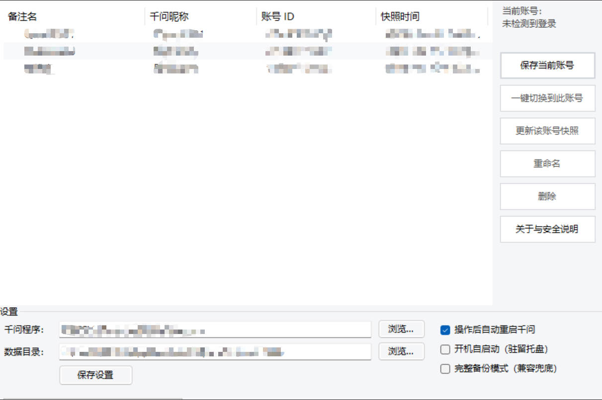
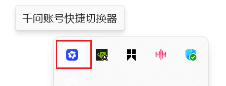

# 千问账号快捷切换器（Qianwen Account Switcher）

一个 Windows 桌面小工具：为**通义千问桌面端**的多个账号各自保存一份"登录态快照"，之后**一键切换**——自动关闭千问、还原目标账号的登录态、重新启动千问，无需反复扫码登录。

纯本地运行、无任何网络请求、绿色便携（单文件 exe + 同目录数据），基于 .NET Framework 4.8 / WinForms。

> ⚠️ 本项目为**非官方第三方工具**，与阿里巴巴/通义千问官方无关。使用前请阅读文末[免责声明](#免责声明)。

---

## 目录

- [功能特性](#功能特性)
- [截图](#截图)
- [运行环境](#运行环境)
- [快速开始](#快速开始)
- [使用说明](#使用说明)
- [工作原理](#工作原理)
- [配置文件说明](#配置文件说明)
- [目录结构](#目录结构)
- [从源码编译](#从源码编译)
- [安全与隐私](#安全与隐私)
- [常见问题](#常见问题)
- [免责声明](#免责声明)

---

## 功能特性

- **一键切换账号**：自动停止千问全部进程 → 还原目标账号登录态 → 重启千问，全程约 10~20 秒。
- **保存当前账号**：把当前已扫码登录的账号存为命名快照，可随时"更新该账号快照"。
- **真实登录态识别**：以千问自身写入的加密凭据文件为准，能正确区分"已登录 / 未登录"，不会把退出登录后的残留状态误存为快照。
- **切换结果验证**：重启千问后自动等待并确认目标账号真正登录成功（最多 25 秒）；未确认时明确弹窗提示，不再"假装成功"。
- **安全网与自动回滚**：每次切换前自动生成完整安全备份（`safetynet_*.zip`），还原失败时自动回滚到切换前状态。
- **最小化备份**：默认只保存与登录态相关的十余个文件/目录（约 5~10 MB），不含缓存；另提供"完整备份模式"作为兼容兜底。
- **跨账号身份清理**：还原时强制清空 Chromium 同步库（Sync Data）等会残留上一账号身份的位置。
- **托盘驻留 / 开机自启**：可最小化到系统托盘，可选开机启动。
- **详细日志**：所有操作按天记录到 `logs/`，方便排查问题。

## 截图





## 运行环境

- Windows 10 / 11（x64）
- [.NET Framework 4.8](https://dotnet.microsoft.com/download/dotnet-framework/net48)（Windows 10 1903 及以上通常已自带）
- 已安装[通义千问 Windows 桌面端](https://www.qianwen.com/)，并至少扫码登录过一次

## 快速开始

1. 在 [Releases](../../releases) 下载最新版压缩包，解压到**任意目录**（建议路径不含特殊字符，例如 `D:\Tools\QianwenSwitcher`）。
2. 确保千问处于登录状态，运行 `QianwenSwitcher.exe`。
3. 首次打开若未自动识别路径，在"设置"里手动选择：
   - **千问程序**：`qianwen.exe` 的完整路径；
   - **数据目录**：千问用户数据目录（默认为 `%LOCALAPPDATA%\qianwen\User Data`）。
4. 点击"保存当前账号"，输入名称（如 `工作号`、`个人号`）。
5. 在千问里退出并扫码登录第二个账号，回到本工具再次"保存当前账号"。
6. 之后在账号列表点击 **"一键切换到此账号"** 即可。

## 使用说明

| 操作 | 说明 |
|---|---|
| 保存当前账号 | 先在千问中登录目标账号，再点此按钮。工具会校验真实登录凭据，**未登录状态会被拒绝保存**，避免污染快照。 |
| 一键切换到此账号 | 停止千问 → 备份安全网 →（若当前账号已登记）顺手更新当前账号快照 → 还原目标快照 → 重启千问 → 验证登录。 |
| 更新该账号快照 | 当某账号的登录态在千问侧刷新过（例如重新扫码），用它把最新登录态写回该账号的快照。 |
| 操作后自动重启千问 | 关闭则只还原文件、不启动千问（适合高级用户手动启动）。 |
| 完整备份模式 | 备份整个 `Default` 配置目录（排除缓存）。体积更大，作为最小清单在新版千问上失效时的兜底方案。 |
| 开机自启动（驻留托盘） | 写入当前用户的注册表 Run 项，仅对当前 Windows 用户生效。 |

## 工作原理

千问桌面端基于 Electron / Chromium，登录态散落在用户数据目录的多个位置（Cookies、Local Storage、IndexedDB、Login Data、应用自身的 `qianwen_user_info` 凭据文件、Chromium 同步库等）。本工具在**文件层面**对这些位置做快照与还原：

```
保存快照：停止千问 → 校验真实登录 → 打包受管文件 → profiles/<账号Id>.zip
切换账号：停止千问 → 安全网备份
          → 更新当前账号快照（仅在确认真实登录时）
          → 解压目标快照到暂存区
          → 删除旧的受管根目录/文件（含强制清空 qianwen_user_info 与 Sync Data）
          → 原子移动暂存文件到位
          → 失败自动回滚安全网
          → 重启千问 → 轮询凭据文件确认真实登录（最多 25 秒）
```

**为什么需要"真实登录"校验？**
千问登录成功后会在 `qianwen_user_info\<用户UID>` 写入数百字节以上的加密凭据；而**未登录/退出登录**时该位置可能只残留一个 22 字节的占位文件（`时间戳|placeholder`），LevelDB 的历史数据文件里也可能残留旧 UID 字符串。早期版本曾因此把"退出态"误判为"已登录"并存成坏快照，导致切换后掉登录。当前版本只承认 **≥100 字节且不含占位内容**的真实凭据文件，从根源上避免该问题。

进程处理上还包含：等待千问全部子进程退出、等待被占用文件释放（最长 20 秒）、还原期间的"复活进程"清扫守护，以应对 Electron 多进程与更新器进程。

## 配置文件说明

程序首次运行在 exe 同目录生成 `config.json`：

```json
{
  "QianwenExePath": "C:\\...\\qianwen.exe",
  "UserDataPath": "C:\\Users\\you\\AppData\\Local\\qianwen\\User Data",
  "RelaunchAfterOperation": true,
  "AutoStart": false,
  "FullMode": false,
  "SnapshotItems": [ "Local State", "Default\\Network", "..." ],
  "Accounts": [
    {
      "Name": "工作号",
      "Uid": "1746xxxxxxxxxxxx",
      "ZipFile": "xxxxxxxx.zip",
      "CreatedAt": "2026-09-13 13:28:05",
      "UpdatedAt": "2026-09-13 18:12:42"
    }
  ]
}
```

| 字段 | 含义 |
|---|---|
| `QianwenExePath` / `UserDataPath` | 千问程序与用户数据目录，可在界面"设置"中修改。 |
| `RelaunchAfterOperation` | 操作完成后是否自动重启千问。 |
| `AutoStart` | 是否开机自启（托盘驻留）。 |
| `FullMode` | 完整备份模式开关。 |
| `SnapshotItems` | 受管文件/目录清单（相对数据目录）。版本升级后缺失的新默认项会在启动时自动合并。 |
| `Accounts` | 已保存账号列表；`Uid` 仅用于本地识别，不含密码。 |

默认受管清单：

```
Local State
Default\Network
Default\Local Storage
Default\Session Storage
Default\IndexedDB
Default\Sync Data
Default\quark_leveldb_storage
Default\SharedStorage
Default\WebStorage
Default\Preferences
Default\Login Data
Default\Login Data For Account
qianwen_user_info
```

> 一般无需手工编辑 `config.json`；如千问未来改版调整了存储位置，可自行增删 `SnapshotItems` 。

## 目录结构

```
QianwenSwitcher/
├─ QianwenSwitcher.exe      # 主程序（绿色单文件）
├─ build.ps1 / build.bat    # 免 SDK 编译脚本（用系统自带 csc.exe）
├─ config.json              # 运行后生成：配置与账号清单
├─ src/                     # C# 源码
│  ├─ Program.cs            # 入口
│  ├─ Models.cs             # 配置/账号/结果等数据模型
│  ├─ UI/                   # WinForms 界面、对话框、托盘
│  └─ Services/             # 配置、身份识别、快照打包/还原、
│                           #   进程管理、开机自启、日志、路径
├─ profiles/                # 运行后生成：账号快照与备份（勿提交、勿外传）
│  ├─ <id>.zip              #   各账号登录态快照
│  ├─ _safety/              #   切换前安全网备份（自动轮转清理）
│  └─ _staging/             #   还原暂存区
└─ logs/                    # 运行后生成：按天日志
```

## 从源码编译

无需安装 Visual Studio 或 .NET SDK——编译脚本直接调用 .NET Framework 自带的 `csc.exe`：

**PowerShell：**

```powershell
powershell -NoProfile -ExecutionPolicy Bypass -File .\build.ps1
```

**或双击 `build.bat`。** 产物为根目录下的 `QianwenSwitcher.exe`（x64）。

如使用 Visual Studio，也可自行新建 .NET Framework 4.8 WinForms 项目并引入 `src/` 下全部 `.cs`，引用 `System.Web.Extensions`、`System.IO.Compression`、`System.IO.Compression.FileSystem`。

## 安全与隐私

- **完全离线**：程序不发起任何网络请求，所有数据只存在于 exe 同目录及千问自己的数据目录。
- **不接触密码**：工具只搬运千问自身已加密的登录凭据与浏览器存储，不读取、不显示、不上传任何账号密码或 Cookie 内容。
- **操作可逆**：每次切换前自动生成安全网备份，异常时自动回滚；`_safety` 中也保留近期备份可供手动恢复。
- **软件自身不写系统目录**：配置、快照、日志全部位于 exe 同目录，拷贝文件夹即可迁移/卸载（开机自启会写当前用户注册表 Run 项，可在界面关闭）。

## 常见问题

**Q：切换后提示"未在 25 秒内检测到登录确认"？**
A：说明该账号快照里的会话可能已在服务端失效。请在千问界面点"登录"重新扫码，登录成功后回到本工具点"更新该账号快照"即可，之后再切换就会恢复正常。

**Q：杀毒软件 / SmartScreen 拦截？**
A：本程序未做代码签名证书，Windows 可能提示"未知发布者"。可查看全部源码后自行编译（见[从源码编译](#从源码编译)），或选择"仍要运行"。

**Q：千问装在非默认目录、或数据目录被改过？**
A：在"设置"中手动指定 `qianwen.exe` 与 User Data 目录即可。

**Q：快照占多大空间？**
A：默认最小清单每个账号约 5~10 MB；完整备份模式取决于账号本地数据量。

**Q：支持多少个账号？**
A：没有硬性上限，列表中每个账号独立一份 zip 快照。

**Q：千问正在更新 / 有 updater 进程怎么办？**
A：停止流程会一并等待并清理 `updater` 等附属进程；若文件持续被占用，会等待最长 20 秒后给出明确报错，不会半途留下半还原状态（失败即回滚）。

**Q：怎么彻底卸载？**
A：在设置里关闭"开机自启动"，删除整个程序文件夹即可（千问本体及其数据不受影响）。


## 免责声明

本工具为个人学习与效率用途的**非官方第三方软件**，与通义千问/阿里巴巴无任何关联。账号登录态的归属与使用须遵守千问官方用户协议；因使用本工具导致的账号异常、数据丢失或其他损失，由使用者自行承担。建议在使用重要账号前先充分验证，并依赖程序自带的安全网备份。
